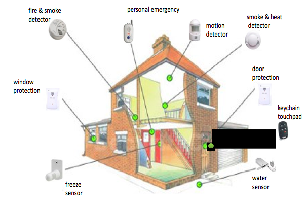

# *__DomoScala__*

### Alessandro Zoffoli ~ Mattia Baldani


---

#Motivations

Build a low cost home automation system, **remotely accessible**, **flexible** and **distributed**.

---

#Context

###Wireless sensor network

> “A network of nodes that sense the environment and may control it, enabling interaction between people and their personalised surroundings”



---

#Technologies

Home automation system using *modern technologies*:
- Scala language 
- Play framework 
- Akka 
- Arduino 

---

#System architecure

* a **server**
* some **Arduino** or other **custom boards** with sensors (temperature, buttons, ...) and actuators (lamps, locks, ...)
* some **clients**:
  - Web application
  - Android app
  - ...

---

#Hardware devices

---

##Sensor ~ Actuators

Based on official **Arduino Uno board**, or custom board based on the **AVR Atmega328**
- wireless connection
- low power consumption, potentially battery powered


---

##Meshnet
A Java and Arduino library that provide a wireless-wired (mixed) mesh network

> Every device is also a router that can relay packets for other devices, extending the wireless range of the whole network


---

#Server

---


---

##Actors

The **core** of the system is a Play framework app.

Most of the active system components are modeled as Akka **actors**, interacting via *message-passing*.


---

##Async

The system handles every request in an *asynchronous, non-blocking way*.

WebSockets allows the implementation of *Publish/Subscribe* feature, that consists of a flow of new contents from the server to the client once they're are produced, *timely*.

---

###REST APIs

```
GET   /buildings
...
GET   /:buildingId/:roomId/:deviceId
```

###Real time values, via WebSocket

```
GET   /push
...
GET   /push/:buildingId/:roomId/:deviceId
```

---

##GET   /buildings

```json
{
   "status":"OK",
   "buildings":[
      {
         "id":"Building0",
         "rooms":[
            {
               "id":"Room0",
               "devices":[
                  {
                     "id":"Bulb0",
                     "devType":"bulb"
                  },
                  {
                     "id":"Button0",
                     "devType":"button"
                  }
               ]
            },
            ...
         ]
      }
   ]
}
```

---

##Real time values

```json
{  
   "buildingId":"Building0",
   "roomId":"Room0",
   "deviceId":"SoundSensor0",
   "um":"decibels",
   "status":{  
      "value":0.6545045971870422
   }
}
```

---

#Clients

---

##HTML + Javascript Frontend
##Android App
###Querying system and subscribing for status update

---

#Demo
